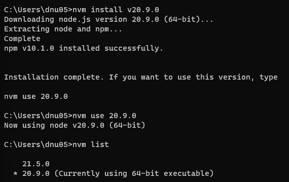

# 1. Node.js 설치

- https://nodejs.org/en/download/current
- 혹은 nvm 설치 https://github.com/coreybutler/nvm-windows/releases
- nvm install [버전] 하면 nvm 설치, use, list 등 이용 가능

# 2. 스벨트 설치
- 스프링 + 스프링부트 & 스벨트 + 스벨트 킷 과 같은 연관관계
** 주의 **
- 프로젝트 생성할 때 인텔리제이를 관리자 권한으로 실행시켜야 해당 명령어를 사용할 수 있음 
> npm create svelte@latest frontapp